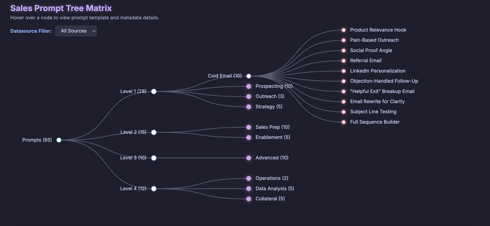

# Sales Prompt Router 🚀

A strategic Sales Agent designed as a **State-Aware Copilot**. This project organizes sales prompts into a hierarchical tree based on the sales development life cycle, enabling intelligent retrieval and analysis.

## 🌟 Key Features

- **Hierarchical Taxonomy**: Prompts organized into 4 tiers (Top-of-Funnel to Ops & Reporting).
- **STAR Metadata**: Every prompt is structured using the STAR (Situation, Task, Action, Result) framework.
- **Visual Intelligence**: Interactive tree visualization of the prompt library.
- **Variable Analysis**: Automated extraction and frequency mapping of user-input variables across categories.
- **Multi-Source Curation**: Balanced mix of punchy Reddit strategies and structured enterprise OpenAI templates.

---

## 🌳 Prompt Hierarchy



```text
Prompts (65)
├── Level 1: Top-of-Funnel (28)
│   ├── Cold Email (10) ➔ e.g., Product Relevance, Pain-Based Outreach
│   ├── Prospecting (10)
│   ├── Outreach (3)
│   └── Strategy (5)
├── Level 2: Mid-Funnel / Prep (15)
│   ├── Sales Prep (10)
│   └── Enablement (5)
├── Level 3: Advanced / Closing (10)
│   └── Advanced (10) ➔ ROI Modeling, High-Stakes Objections
└── Level 4: Ops & reporting (12)
    ├── Operations (2)
    ├── Data Analysis (5)
    └── Collateral (5)
```

---

## 🏗️ Project Structure

```text
.
├── data/
│   ├── mvp_prompts.json      # The core prompt library
│   └── DATA_GENERATION.md    # Methodology and data structure details
├── scripts/
│   └── analyze_variables.py  # Python script for variable intelligence
├── visualize.html            # Web-based interactive tree visualization
├── agent.md                  # Strategic implementation roadmap
└── requirements.txt          # Python dependencies
```

---

## ⚙️ Environment Setup

This project uses `uv` for lightning-fast Python package management.

### 1. Prerequisites
Install `uv` if you haven't already:
```bash
curl -LsSf https://astral.sh/uv/install.sh | sh
```

### 2. Initialization
Create the virtual environment and install dependencies:
```bash
uv venv
uv pip install -r requirements.txt
```

---

## 📊 Usage

### Interactive Tree Visualization
Since the visualization fetches local JSON data, you must run it through a local web server to avoid browser CORS restrictions.

1. Start a local server:
   ```bash
   python3 -m http.server 8000
   ```
2. Visit [http://localhost:8000/visualize.html](http://localhost:8000/visualize.html) in your browser.

- **Filter**: Toggle between Reddit and OpenAI sources.
- **Inspect**: Hover over nodes to see STAR metadata, ID, and the full prompt template.

### Variable Intelligence Report
Analyze how shared variables (like `[Company Name]`) flow across different sales categories.

1. Activate the environment:
   ```bash
   source .venv/bin/activate
   ```
2. Run the analysis:
   ```bash
   python scripts/analyze_variables.py
   ```
3. Open the newly generated `variable_analysis_report.html` to view the dashboard.

---

## 🛠️ Roadmap (Build Phases)

1. **Phase 1: Semantic Mapping**: Embed metadata for "vibe-based" retrieval.
2. **Phase 2: Variable Slot-Filling**: extraction layer for missing placeholders.
3. **Phase 3: Feedback Loop**: Implement success-weighted retrieval based on results.

---

## 📄 License
Internal Development - Sales Strategy Team.
