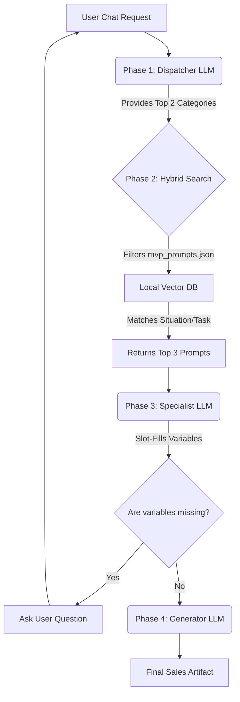
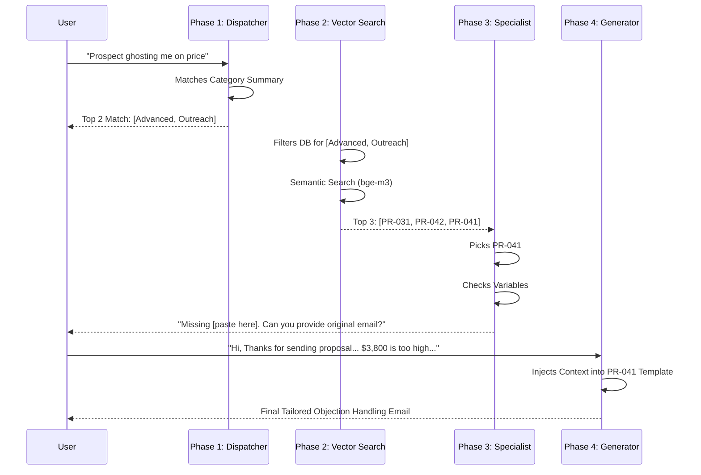

# Sales Prompt Router: Backend Architecture

## 1. System Overview
The Sales Prompt Router is a **State-Aware Slot-Filling AI Agent**. It uses a **4-Phase Execution Pipeline** to navigate a dynamic payload of sales prompts (`mvp_prompts.json`). 

Instead of stuffing large lists of prompts into context windows, the backend uses a "Zoom and Filter" approach, leveraging LLMs exclusively for classification, reasoning, and generation, while relying on local Hybrid Search (Qdrant) for deterministic retrieval.



---

## 2. The 4-Phase Execution Pipeline

### PHASE 1: The "Dispatcher" (Category Routing)
**Goal:** Narrow down the universe of possibilities from 10+ categories to the Top 2 most relevant categories.
*   **Component:** `gemini-2.5-flash` (via `google-genai` SDK).
*   **System Prompt Injection:** `data/category_summary.json` (67 lines).
*   **Input:** User's unstructured chat request.
*   **Logic:** The LLM evaluates intent against high-level Level/Category summaries using structured Pydantic outputs.
*   **Output:** JSON array containing Top 2 categories (e.g., `["Cold Email", "Sales Prep"]`).

### PHASE 2: The "Hybrid Search" (Local Retrieval)
**Goal:** Transition from Categories to specific Prompt IDs using semantic and keyword matching.
*   **Component:** Python Backend + **Qdrant (Local Serverless)** + **FastEmbed**.
*   **Data Source:** `data/mvp_prompts.json` (Encoded locally into binary vector files).
*   **Logic Flow:**
    1.  **Hard Filter:** Only searches prompts within the Top 2 categories from Phase 1.
    2.  **Hybrid Search:** Performs concurrent Dense (Semantic) and Sparse (Keyword/BM25) search.
    3.  **RRF Fusion:** Uses Reciprocal Rank Fusion to merge results.
*   **Output:** The Top 3 highest-scoring prompt objects.

### PHASE 3: The "Specialist" (Extraction & Slot-Filling)
**Goal:** Select the ultimate winner and identify missing variables.
*   **Component:** `gemini-2.5-flash`.
*   **Logic Flow:**
    1.  **Evaluate:** Reads the 3 choices and determines the best single fit.
    2.  **Slot-Fill:** Compares the winning prompt's `variables` array against known context.
    3.  **Negotiate:** If variables are missing, generates a conversational clarifying question.
*   **Output:** Winning Prompt ID + List of missing variables + Clarifying question.

### PHASE 4: The "Generator" (Production)
**Goal:** Merges the final context into the prompt template to produce the output.
*   **Component:** `gemini-2.5-flash`.
*   **Logic:** Injects the fully-collected User Context into the selected prompt template.
*   **Output:** Final Sales Artifact (Email, Sequence, or Prep Doc).

---

## 3. Data Infrastructure

### A. Context Manifest (Session State)
Maintained in memory (or Redis) per user session. Prevents the agent from asking the user for the same information twice.
```json
{
  "global_context": {
    "user_product": "CloudScale AI",
    "industry": "Software"
  },
  "prospect_context": {
    "company_name": "Acmecorp",
    "target_roles": ["CTO"]
  },
  "missing_variables": ["specific pain point"]
}
```

### B. Prompt Storage (`mvp_prompts.json`)
The source of truth for all agent skills. Must strictly maintain the STAR architecture:
*   `metadata.S` - For Trigger matching.
*   `variables` - For Slot-Filling and Context Negotiation.

---

## 4. Scalability & Benefits
*   **$0.00 Context Cost:** The context windows never grow, regardless of whether there are 50 or 5000 prompts in the database.
*   **Zero Hallucination:** The agent can only select Prompt IDs that are retrieved by the deterministic Python/Vector backend.
*   **Safety Net:** Fetching the Top 2 categories in Phase 1 prevents vector misclassification for vaguely worded user inputs.

---

## 5. Workflow Example in Action

Here is a visual breakdown of how the agent handled the "Ghosting on Price" scenario:



### Execution Log Trace

Here is an actual trace of the 4-phase pipeline handling a complex user request involving missing information.

```text
====================================
 STARTING HYBRID PIPELINE EXECUTION
====================================

[PHASE 1] Dispatcher analyzing query: 'I need an email for a prospect who has been ignoring my demo request because they think the price is too high.'
 -> Selected Categories: ['Advanced', 'Outreach']
 -> Reasoning: The user needs an email to address a prospect's price objection and re-engage them after they've been ignoring requests. 'Advanced' is chosen for addressing the price objection, as it involves justifying value and ROI in complex deals (e.g., 'Pricing Tier Justification'). 'Outreach' is chosen for the re-engagement aspect, as the email needs to break through the silence, similar to a 'Helpful Exit' Breakup Email.

[PHASE 2] Executing Hybrid Search for categories: ['Advanced', 'Outreach']
 -> Top 3 matches found: ['PR-031', 'PR-042', 'PR-041']

[PHASE 3] Specialist identifying final prompt and missing variables...
 -> Selected Prompt ID: PR-041
 -> Missing Variables: ['paste here']
 -> Agent Question: To help me craft the best email, could you please provide the original email you've been sending or would like me to rewrite?

====================================
 FINAL PIPELINE RESULT
====================================
Goal: I need an email for a prospect who has been ignoring my demo request because they think the price is too high.
Winning Prompt: PR-041

🤖 Agent: To help me craft the best email, could you please provide the original email you've been sending or would like me to rewrite?
   (Missing variables: ['paste here'])
🗣️  You: Hi,Thanks for sending over the proposal. I’ve had a chance to review it, and I wanted to be transparent about where we’re at... The $3,800 fee is coming in quite a bit higher than what we were expecting... Let me know your thoughts. Best, Henry

[UPDATING SESSION CONTEXT]
 -> Filling slot 'paste here' with user input.

[PHASE 4] Generating final artifact for PR-041...

====================================
 🎉 FINAL GENERATED SALES ARTIFACT
====================================
Subject: Following up on our Tax Strategy Discussion for Stripe

Hi Sarah,

It was great connecting with you and the team last week to discuss Stripe's evolving tax needs...

We understand that evaluating new partners for a critical "tax engagement" involves careful consideration of both scope and investment. Henry's feedback regarding the $3,800 proposal versus other quotes around $2,500 was insightful, and it brings to light a common challenge...

To ensure our solution aligns perfectly with Stripe's specific vision and addresses any questions you or Henry might have regarding our value proposition, I'd suggest a brief follow-up...

Looking forward to ensuring we find the best strategic path forward for Stripe.

Best,

[Your Name]
```
