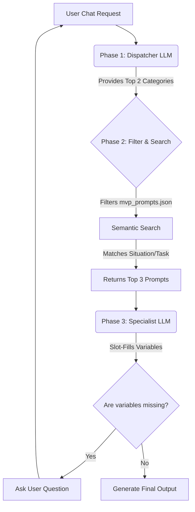

# Sales Prompt Router: Backend Architecture

## 1. System Overview
The Sales Prompt Router is a **State-Aware Slot-Filling AI Agent**. It uses a 3-step Hierarchical Routing pipeline to navigate a dynamic payload of sales prompts (`mvp_prompts.json`). 

Instead of stuffing large lists of prompts into context windows (which causes token bloat and hallucination), the backend uses a "Zoom and Filter" approach, leveraging LLMs exclusively for classification and variable extraction, while relying on deterministic Python logic and Vector DBs for retrieval.



---

## 2. The 3-Step Retrieval Pipeline

### PHASE 1: The "Dispatcher" (Category Routing)
**Goal:** Narrow down the universe of possibilities from 10+ categories to the Top 2 most relevant categories.
*   **Component:** Fast/Cheap LLM (e.g., `gpt-4o-mini`, `claude-3-haiku` or a Fine-Tuned Small Model).
*   **System Prompt Injection:** `data/category_summary.json` (67 lines).
*   **Input:** User's unstructured chat request (e.g., *"I need an email for a prospect who ghosted me on price."*).
*   **Logic:** The LLM evaluates the user intent against the high-level Level/Category summaries.
*   **Output:** Strict JSON array containing the Top 2 categories: `["Cold Email", "Sales Prep"]`.

### PHASE 2: The "Filter & Search" (Data Retrieval)
**Goal:** Transition from Categories to specific Prompt IDs using semantic matching.
*   **Component:** Python Backend + Vector Database (e.g., FAISS, ChromaDB, Pinecone).
*   **Data Source:** The master `data/mvp_prompts.json` file.
*   **Logic Flow:**
    1.  **Filter:** The Backend drops all prompts that do not belong to the Top 2 categories identified in Phase 1.
    2.  **Semantic Search:** The Backend embeds the user's query and performs a Cosine Similarity Search against the `metadata.S` (Situation) and `metadata.T` (Task) fields of the remaining prompts.
*   **Output:** The Top 3 highest-scoring prompt objects (Full JSON payload including `template` and `variables`).

### PHASE 3: The "Specialist" (Extraction & Generation)
**Goal:** Select the ultimate winner, compare required variables against known context, and generate the final output or ask a clarifying question.
*   **Component:** Reasoning LLM (e.g., `gpt-4o`, `claude-3.5-sonnet`).
*   **System Prompt Injection:** The Top 3 Prompt JSON objects from Phase 2.
*   **Logic Flow:**
    1.  **Evaluate:** The LLM reads the 3 choices and determines the best absolute fit.
    2.  **Slot-Fill:** The LLM looks at the `variables` array of the winning prompt. It checks the current session's "Context Manifest" to see what data is already known (e.g., `Company Name`).
    3.  **Execute:**
        *   *If variables are missing:* It outputs a clarifying question to the user (e.g., *"What specific pricing concern did they mention?"*).
        *   *If all variables are present:* It generates the final sales artifact.
*   **Output:** Final Text Artifact OR Clarifying Question to the UI.

---

## 3. Data Infrastructure

### A. Context Manifest (Session State)
Maintained in memory (or Redis) per user session. Prevents the agent from asking the user for the same information twice.
```json
{
  "global_context": {
    "user_product": "CloudScale AI",
    "industry": "Software"
  },
  "prospect_context": {
    "company_name": "Acmecorp",
    "target_roles": ["CTO"]
  },
  "missing_variables": ["specific pain point"]
}
```

### B. Prompt Storage (`mvp_prompts.json`)
The source of truth for all agent skills. Must strictly maintain the STAR architecture:
*   `metadata.S` - For Trigger matching.
*   `variables` - For Slot-Filling and Context Negotiation.

---

## 4. Scalability & Benefits
*   **$0.00 Context Cost:** The context windows never grow, regardless of whether there are 50 or 5000 prompts in the database.
*   **Zero Hallucination:** The agent can only select Prompt IDs that are retrieved by the deterministic Python/Vector backend.
*   **Safety Net:** Fetching the Top 2 categories in Phase 1 prevents vector misclassification for vaguely worded user inputs.
